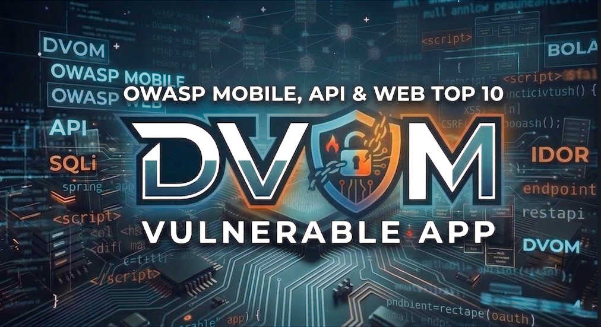
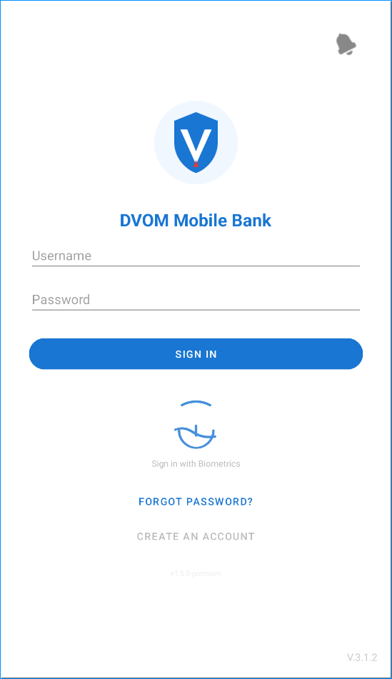
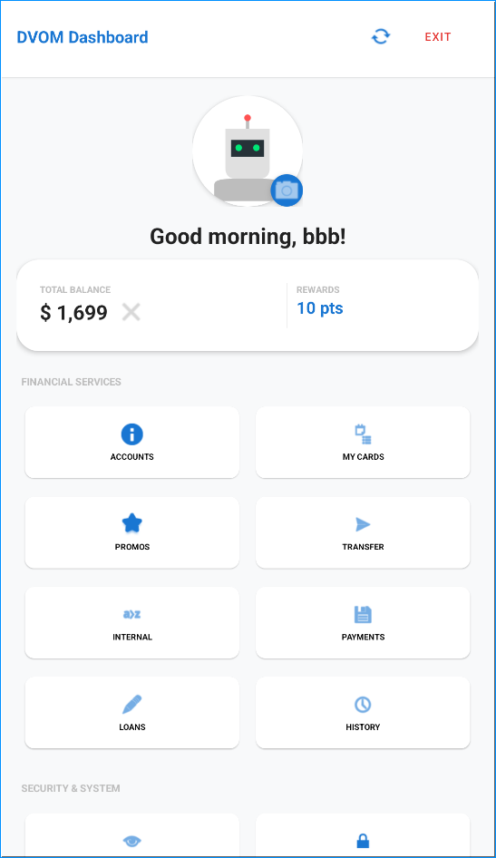
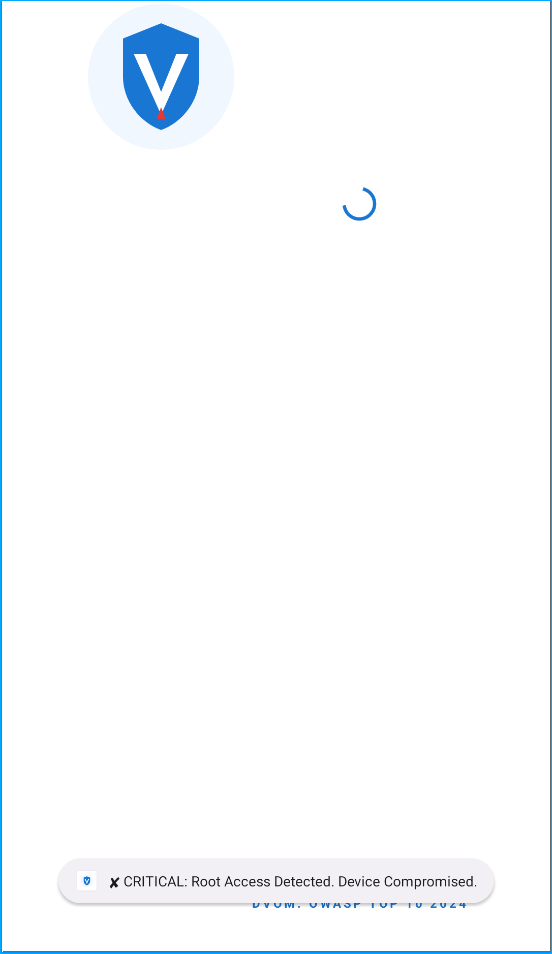
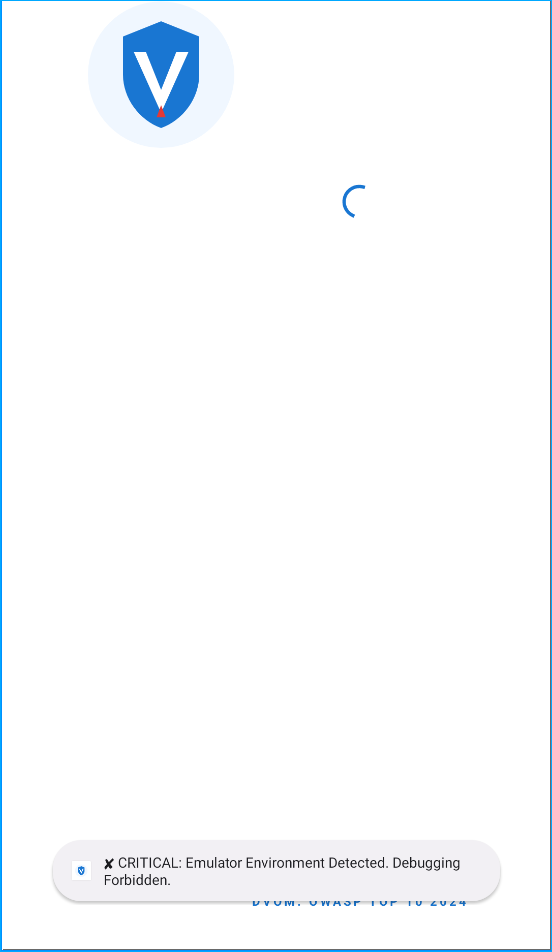
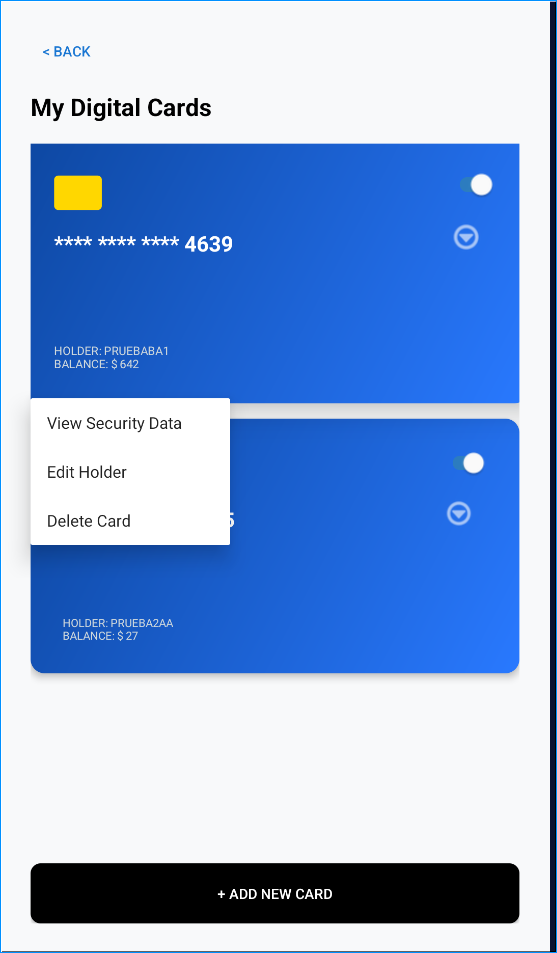
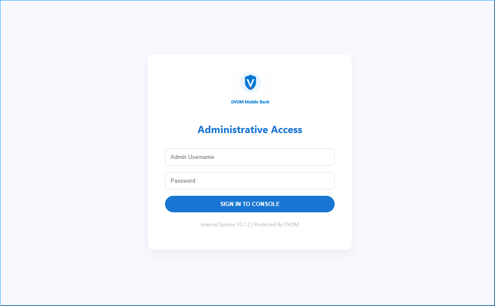
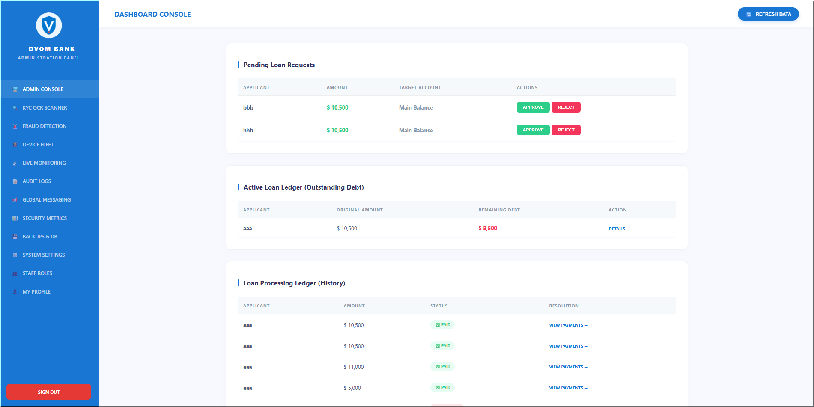

# 📱 DVOM - Damn Vulnerable OWASP Mobile

**DVOM (Damn Vulnerable OWASP Mobile)** is a deliberately insecure Android banking ecosystem designed for security professionals, developers, and students to practice mobile, API, and web security testing in a controlled environment.

<p align="center">
  
</p>

<p align="center">
  <b>A realistic bank vulnerability analysis lab focused on OWASP Mobile Top 10 2024, OWASP API Top 10 2023 and OWASP WEB Top 10 2025.</b>
</p>

<p align="center">
  
  
  
  
  
  
  
  
</p>

---

## 📌 Overview

**DVOM (Damn Vulnerable OWASP Mobile)** is a deliberately vulnerable Android banking ecosystem with a REST API and web-based administrative portal, designed to simulate real-world mobile, API, and web application security risks.

It provides a realistic digital banking experience while serving as a controlled lab for practicing security testing aligned with OWASP Mobile Top 10 2024, OWASP API Security Top 10 2023, and OWASP Top 10 2025.

⚠️ **Security Warning:** DVOM is intentionally vulnerable by design and must only be used in isolated, authorized, and controlled environments.

---

## 🎯 Purpose

The primary mission of DVOM is to provide a comprehensive "Exploitation Playground" to master:

*   **Mobile Security (OWASP Mobile Top 10: 2024):** Deep dive into insecure storage, weak cryptography, and client-side logic bypasses.
*   **API Security (OWASP API Top 10: 2023):** Practice BOLA (IDOR), Mass Assignment, and improper inventory management.
*   **Web Security (OWASP Web Top 10: 2025):** Exploit the administrative portal via SSRF, XSS, and Broken Access Control (RBAC).
*   **Runtime Manipulation:** Dynamic instrumentation using **Frida** to bypass SSL Pinning, inspect and understand encrypted application-layer traffic.
*   **Advanced Cryptanalysis:** Breaking custom AES-128-CBC implementations and exploiting JWT KID (Key ID) Injections.
*   **Business Logic Abuse:** Manipulating financial flows, loan approvals, and compliance states.

---

## 🚀 Core Modules & Features

### 📱 1. Android Native Application
*   **Onboarding Lifecycle:** 4-step registration process with insecure local persistence (UserDB), alphanumeric identity validation, and KYC document capture.
*   **Multi-Asset Wallet:** Dynamic management of multiple savings accounts and digital debit cards with **professional integer formatting (e.g., $ 3,500)**.
*   **Transaction Engine:** P2P transfers via ID or QR code injection, and internal movements between user assets.
*   **Advanced Loan Center:** Management of active debts (**Outstanding Debt**) with real-time amortization and detailed payment history panel.
*   **Smart Scheduler:** Scheduling of transfers and utility payments with asynchronous background execution.
*   **Compliance Guard:** Real-time account status system (Active/Blocked/Pending) with visual badges.

### ⚙️ 2. High-Fidelity Banking API (Backend)
*   **Crypto Middleware:** Interception system that automatically encrypts/decrypts all incoming and outgoing JSON payloads.
*   **Identity Provider (JWT):** Session management using tokens with **KID Injection**, **Path Traversal**, and **Stateless State Manipulation (Locked User bypass)**.
*   **Security Enforcement:** Intentional delegation of authorization checks to the mobile client (Client-side enforcement vulnerability).
*   **Business Logic Engine:** Loan logic vulnerable to Mass Assignment and BOLA (API1) processes in payment history and resource management.
*   **Asynchronous Worker:** Independent engine for processing scheduled tasks every 30 seconds.

### 🖥️ 3. Web Administrative Portal
*   **RBAC Architecture:** Multi-user role system (ADMIN, CUSTOMER SERVICE, SUPPORT) with dynamic interfaces and colors per access level.
*   **Operations Console:** Total user management with a search bar vulnerable to SQLi and animated "Audit Stamp" for credit approvals.
*   **Compliance Center:** Logical separation between profile photos (Avatars) and official documents (KYC) for privacy audits.
*   **Fraud Detection Center:** Real-time monitoring of failed login attempts and clear-text credential leaks.
*   **Security Metrics (IPS Simulation):** Interactive charts (Chart.js) that detect and visualize SQLi, SSRF, and RCE attacks in real-time.
*   **Infrastructure Tools:** Webhook tester (SSRF) and technical log viewer with a notification system (Toasts).

---

## 🕵️‍♂️ Vulnerability Matrix (Audit Checklist)

DVOM covers a wide spectrum of security flaws, specifically mapped to the latest industry standards.

### 📱 OWASP Mobile Top 10: 2024
*   **M1: Improper Credential Usage:** Hardcoded master bypass code and insecure credential processing.
*   **M2: Inadequate Supply Chain Security:** Integration of vulnerable third-party simulated libraries and insecure backend dependencies.
*   **M3: Insecure Authentication / Authorization:** Simulated biometric bypass and lack of server-side ownership validation for resource IDs.
*   **M4: Insufficient Input / Output Validation:** Command injection via filenames and automated field injection through unvalidated QR data.
*   **M5: Insecure Communication:** Bypassable SSL Pinning and lack of certificate transparency enforcement.
*   **M6: Inadequate Privacy Controls:** Excessive hardware ID exfiltration and sensitive data printed to system-wide debug buffers.
*   **M7: Insufficient Binary Protections:** Complete absence of code obfuscation, allowing full logic recovery via JADX-GUI.
*   **M8: Security Misconfiguration:** Unprotected exported activities and receivers allowing remote app manipulation.
*   **M9: Insecure Data Storage:** Persistence of PII and active session tokens in unencrypted local file systems.
*   **M10: Insufficient Cryptography:** Usage of static, hardcoded AES-128-CBC keys and lack of hardware-backed key storage.

### ⚙️ OWASP API Security Top 10: 2023
*   **API1: Broken Object Level Authorization:** Manipulate `loan_id` or `user_id` to see or modify other users' assets and debts.
*   **API2: Broken Authentication:** Weak JWT secrets and bypassable OTP logic.
*   **API3: Broken Object Property Level Authorization:** Sensitive PII (DNI, Email) leaked in every profile JSON response.
*   **API4: Unrestricted Resource Consumption:** Denial of Service (DoS) via huge report generation requests.
*   **API5: Broken Function Level Authorization:** Accessing admin/staff endpoints from lower-privileged sessions.
*   **API6: Unrestricted Access to Sensitive Business Flows:** Status and balance manipulation in Loan payments (Mass Assignment).
*   **API7: Server Side Request Forgery:** Exploiting the Webhook Tester to scan internal ports or read local files.
*   **API8: Security Misconfiguration:** Permissive CORS (`*`) and missing security headers.
*   **API9: Improper Inventory Management:** Exposure of infrastructure docs and legacy endpoints.
*   **API10: Unsafe Consumption of APIs:** Prompt Injection in the AI Assistant to leak backend credentials.

### 🖥️ OWASP Web Top 10: 2025
*   **A01: Broken Access Control:** Vertical and Horizontal privilege escalation through direct URL manipulation.
*   **A02: Security Misconfiguration:** Stack trace disclosure revealing absolute file paths and sensitive source code logic.
*   **A03: Software Supply Chain Failures:** Use of simulated legacy AI libraries with known secrets leak.
*   **A04: Cryptographic Failures:** Administrative passwords stored in cleartext and hardcoded session signing keys.
*   **A05: Injection:** SQL Injection in the Admin Search bar and Stored XSS in Global Messaging.
*   **A06: Insecure Design:** Failures in KYC enforcement and manual status activation without verification.
*   **A07: Authentication Failures:** Weak admin credentials and lack of brute force protection.
*   **A08: Software or Data Integrity Failures:** Insecure Deserialization (Expert Level) in the OCR processing unit.
*   **A09: Security Logging and Alerting Failures:** Logging of mistyped passwords in cleartext within the Fraud Center.
*   **A10: Mishandling of Exceptional Conditions:** Fail-Open login logic where system crashes grant administrative access.

---

## ⚙️ Server Intelligence & Infrastructure

### 🤖 Asynchronous Background Worker
A dedicated engine that processes scheduled transfers and utility payments every 30 seconds, simulating real-world asynchronous banking operations.

### 🔐 Defensive Layer (Vulnerable by Design)
*   **JWT Ecosystem:** Industry-standard identity tokens with intentional PII leakage, **KID Injection**, and **Locked-State Forgery** vulnerabilities.
*   **Application-Layer Encryption:** AES-128-CBC encryption for all JSON payloads, featuring hardcoded keys for reverse-engineering practice.
*   **RBAC Enforcement (Insecure):** UI-level role filtering that can be bypassed by direct endpoint access.
---

## 🚧 Project Status

| Feature | Status |
|---|---|
| Android App | ✅ Available |
| Flask API | ✅ Available |
| Docker Deployment | ✅ Available |
| APK Release | ✅ Available |
| API Documentation | ✅ Available |
| KYC Onboarding | ✅ Available |
| Account Management | ✅ Available |
| Card Management | ✅ Available |
| Transfers | ✅ Available |
| Scheduled Transfers | ✅ Available |
| Scheduled Payments | ✅ Available |
| Digital Vault | ✅ Available |
| AI Security Assistant | ✅ Available |
| AES Communication Interceptor | ✅ Available |
| Scheduler Worker | ✅ Available |
| Writeups | 📝 Planned |
| Frida Scripts | 📝 Planned |
| Postman Collection | 📝 Planned |
| Future Modules | 🔍 Under Review |


### 🌐 Network Configuration (Port Mapping)

For laboratory consistency and to avoid conflicts with other local services, DVOM uses a specific port mapping:

> **Note for Mobile App:** If you are using the Android App with the Docker deployment, you must set the Backend URL to `http://[YOUR_IP]:8443` in the app's secret configuration menu (Long press on the bank logo at Login).

When running via Docker, the laboratory uses the following port mapping to avoid conflicts with other local services:

| Service | Internal Port | External Port (Docker) | Access URL |
| :--- | :--- | :--- | :--- |
| **Banking API** | 8080 | **8443** | `http://YOUR_IP:8443/` |
| **Admin Portal** | 8080 | **8443** | `http://YOUR_IP:8443/admin` |
| **API Docs** | 8080 | **8443** | `http://YOUR_IP:8443/docs` |

## 🔑 Default Lab Users

When DVOM is started with Docker, the database is automatically initialized with the default demo users required to test the lab.

> ⚠️ These credentials are intentionally weak and are included only for educational and laboratory purposes.

### 🖥️ Web Administrative Portal - Staff Users

| Username | Password | Role |
|---|---|---|
| `admin` | `admin123` | 👑 `ADMIN` |
| `carla` | `carla123` | 🎧 `CUSTOMER_SERVICE` |
| `pepe` | `pepe123` | 🛠️ `SUPPORT` |

### 📱 Mobile App - Default User

| Username | Password | Notes |
|---|---|---|
| `cala` | `cala123` | Default mobile banking user |

### 📌 Notes

- The database is automatically created during Docker startup if it does not already exist.
- These users are part of the intentionally vulnerable DVOM lab environment.
- Additional users can be created manually through the mobile app or the administrative portal.
- Credentials are weak by design.
- Do not reuse these credentials in real systems.
- DVOM must only be used in isolated and controlled environments.

---

## ⚙️ Installation

### Option 1 - Run with Docker

```bash
git clone https://github.com/your-username/dvom.git
cd dvom
docker-compose up --build
```

The API should be available at: `http://YOUR_IP:8443`,
The interactive documentation should be available at: `http://YOUR_IP:8443/docs`,
The administrative portal `http://YOUR_IP:8443/admin`

---

### Option 2 - Run the server manually

```bash
git clone https://github.com/your-username/dvom.git
cd dvom/server
pip install -r requirements.txt
python server.py
```

---

### Android APK

The compiled APK is available under: `dvom.apk`. Install it using ADB:

```bash
adb install dvom.apk
```

---

## 📸 Screenshots

<p align="center">
  
  
  
</p>

<p align="center">
  
  
</p>

<p align="center">
  
  
</p>

---

## 🔐 Ethical Use Only

DVOM is intentionally vulnerable and must only be used in controlled environments. You are allowed to use this project for personal learning, internal training, university labs, security workshops, and ethical research.

---

## ⚠️ Disclaimer

This repository is provided for educational and research purposes only. The author is not responsible for any misuse, damage, or illegal activity performed using this project.
DVOM is an independent educational project and is not affiliated with, endorsed by, or officially certified by OWASP.

---

## 🧑‍💻 Author
Developed by **Kelvin López**
- GitHub: [@memohk](https://github.com/memohk)
- LinkedIn: [Kelvin López](https://www.linkedin.com/in/kelvin-lópez/)
- Website: [SecProNet](https://secpronet.blogspot.com/)

---

## ⭐ Support
If this project helps you learn, please **Star this repository** and practice ethically!

---

## 📜 License

DVOM is provided under a custom Educational Use License.

The APK, documentation, screenshots, and writeups are intended only for personal learning, internal training, academic labs, authorized workshops, and ethical security research.

Commercial redistribution, resale, malicious use, or use against systems without explicit authorization is strictly prohibited.

See the `LICENSE` file for more details.

---
